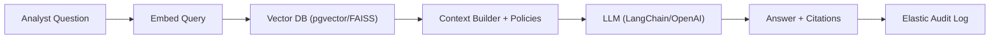

# 👋 Hi, I'm Ranadeep Mahendra!

Full-Stack SWE (4+ yrs) building **Java/Spring Boot + React/Next.js** platforms on **AWS** with **Kafka, PostgreSQL, Docker/K8s, Terraform**, and production **RAG/LLM** features. I optimize for **p95 < 200ms**, **zero-downtime** releases, and clear **SLOs**.

[](https://ranadeepdev.online)
[](https://www.linkedin.com/in/ranadeep-mahendra-6534b41b7/)
[](https://github.com/RanadeepMahendra2000)
[](mailto:workwithranadeep@gmail.com)

---
## 🏆 My LeetCode Progress

    

### 📊 LeetCode Activity Graph


---

## 🧰 Tech Stack


---

## 🌟 Featured Projects
| Project | What it is | Impact | Stack |
|---|---|---|---|
| **Trade Settlement Platform** | High-throughput microservices for settlements | **1M+ tx/day**, **p95 < 200ms**, zero-downtime | Spring Boot • Kafka Streams • EKS • Redis • PostgreSQL |
| **Portfolio & Analytics APIs** | Portfolio/analytics surfaces for global managers | **1.5M+ logs/day**, reports **3h → <40m** | Spring Boot • GraphQL/REST • Redis • Elastic • Lambda |
| **GenAI Trade Insights Assistant** | RAG assistant over trades/positions | **6+ analyst-hours/day saved** | FastAPI • LangChain • OpenAI • pgvector/FAISS • S3 • Elastic |
| **Gmail Job Tracker** | Auto-tag & triage job emails | **~70% faster triage** | React • TypeScript • Supabase (RLS/Edge) • OAuth • CI/CD |

> More write-ups & live demos → **https://ranadeepdev.online**

---


**Architecture snapshot (Mermaid flow):**

```mermaid
flowchart TB
  subgraph Client
    UI[React/Next.js]
  end
  UI --> GW[API Gateway]
  subgraph AWS EKS
    SVC1[Spring Boot • Trades]
    SVC2[Spring Boot • Reconciliation]
  end
  GW --> SVC1
  GW --> SVC2
  SVC1 -- events --> KAFKA[(Kafka Streams)]
  SVC2 -- events --> KAFKA
  SVC1 --> PG[(PostgreSQL)]
  SVC2 --> PG
  KAFKA --> ES[(Elasticsearch/Kibana)]
```


**Analytics/Compliance query lifecycle (Mermaid sequence):**


## 🧠 RAG / GenAI pipeline (fixed Mermaid)


**Zero-downtime release (Mermaid Gantt):**
```mermaid
gantt
  dateFormat  YYYY-MM-DD
  title Progressive Delivery
  section Build
  Compile & Unit Tests     :a1, 2025-01-01, 1d
  Dockerize & SBOM         :a2, after a1, 1d
  section Verify
  Contract/Smoke Tests     :b1, after a2, 1d
  Load Tests (k6)          :b2, 1d
  section Deploy
  Blue/Green to Staging    :c1, after b2, 1d
  Canary 10%→50%→100%      :c2, 1d
  Post-deploy SLO Watch    :c3, 1d
```

**Operating KPIs (snapshot):**
```
Latency p95 (ms): 230 → 190 → 170 → 155
Error rate (%):   1.1 → 0.7 → 0.4 → 0.3
MTTD (mins):      7   →  5  →  4  →  3
```


**Pin-worthy repos (rename to your actual repo names/links):**  
- 🚀 settlement-platform — Spring Boot + Kafka Streams on EKS (blue/green + canary)  
- 📈 portfolio-analytics-api — GraphQL/REST analytics with Redis caching  
- 🧠 genai-trade-assistant — FastAPI + LangChain RAG with pgvector/FAISS  
- ✉️ gmail-job-tracker — Supabase + OAuth, embeddings auto-tagging  
- 🧰 devops-iac-blueprints — Terraform modules, GitHub Actions, ArgoCD patterns  

**Contact:** workwithranadeep@gmail.com • +1-716-533-5625 • Florida, USA (open to relocate) • LinkedIn: linkedin.com/in/ranadeep-mahendra-6534b41b7 • Portfolio: ranadeepdev.online
